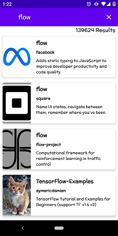
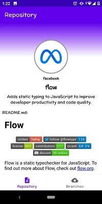
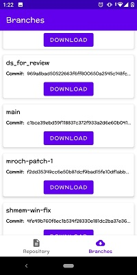
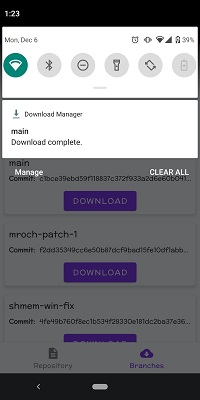

# Branch Downloader

Branch Downloader é um aplicativo Android desenvolvido para que o usuário possa baixar branches de repositórios do Github.

## Índice

* [Funcionalidades](#funcionalidades)
* [Aplicação](#aplicação)
* [Setup](#setup)
* [Ferramentas utilizadas](#ferramentas-utilizadas)
* [Autores](#autores)

## Funcionalidades

- '1ª Funcionalidade:' Pesquisar por repositórios.
- '2ª Funcionalidade:' Descrever repositório.
- '3ª Funcionalidade:' Listar branches do repositório.
- '4ª Funcionalidade:' Baixar branch.

## Aplicação

 

## Setup

- Clone o projeto:
    - 'git clone https://github.com/sebastiaolucas/BranchDownloader.git'
- Abra o projeto:
    - Abra o 'Android Studio'
    - 'Open an Existing Project'
    - Procure pelo local onde clonou o projeto
    - 'Ok'

## Ferramentas utilizadas

- [Kotlin](https://kotlinlang.org/)
- [Android Studio](https://developer.android.com/studio)
- [Navigation](https://developer.android.com/guide/navigation)
- [Data Binding Library](https://developer.android.com/topic/libraries/data-binding?hl=pt-br)
- [Coil](https://coil-kt.github.io/coil/getting_started/)
- [ViewModel](https://developer.android.com/topic/libraries/architecture/viewmodel?hl=pt-br)
- [Koin](https://insert-koin.io/)
- [Retrofit](https://square.github.io/retrofit/)
- [GitHub Api](https://docs.github.com/pt/rest)

## Autores

| [ Sebastião Lucas](https://github.com/sebastiaolucas) |
| :---: